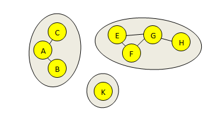

# Migrating 500M Rows
### From PostgreSQL to ClickHouse

<p class="center"><small>A TheirStack Journey</small></p>

---

## The Scale

- **110 million** jobs
- **5 million** companies  
- **30k** technologies tracked
- **500M+** rows to migrate


--

## Row-based VS column-based


---

## PostgreSQL: the struggles

1. Indexing on many columns
2. Index size
3. Updates on all rows
4. Table partitioning
5. RAM needs
6. Arquitecture

--

### Indexing issues

1. 🙂 We add a field
2. 😅 Users want to filter by it
3. 🙄 No indices -> slow queries -> we add an index on that col
4. 😵‍💫 Indices become larger than RAM -> we add more RAM
5. 🤷‍♂️ RAM: 16GB -> 32GB -> 64GB. Barely no improvements

--

### Solution? Partitioning...?

- Jobs table -> `jobs_2024_01, jobs_2024_02, ...`  
<!---  -->


--

### Partitioning: simple version


Simple version

```sql
ALTER TABLE job RENAME TO job_old;

CREATE TABLE job (LIKE job_old INCLUDING ALL) PARTITION BY RANGE (date_posted);

ALTER TABLE job_old
ADD CONSTRAINT jobs_old CHECK (date_posted BETWEEN '1970-01-01' AND '2024-01-01')

ALTER TABLE job ATTACH PARTITION job_old
FOR VALUES FROM ('1970-01-01') TO ('2024-01-01');

CREATE TABLE public.job_2023_12 PARTITION OF public.job FOR 
    VALUES FROM ('2023-12-01') TO ('2024-01-01');
CREATE TABLE public.job_2024_01 PARTITION OF public.job FOR 
    VALUES FROM ('2024-01-01') TO ('2024-02-01');
...
```
<p class="highlight-orange">⚠️ Partitions aren't created automatically</p>

--

### Partitioning: gotchas

<blockquote class="small-text">To create a unique or primary key constraint on a partitioned table, the partition keys must not include any expressions or function calls and the constraint's columns must include all of the partition key columns... - <a href="https://www.postgresql.org/docs/current/ddl-partitioning.html#DDL-PARTITIONING-DECLARATIVE-LIMITATIONS">source</a></blockquote>

--

### Partitioning: extra work

Before creating partitions:
1. Drop constraints

And after:
1. Recreate constraints
2. Drop triggers on initial partition
3. Recreate triggers on new table

--

### Partitioning: indices

<p class="highlight-orange">⚠️ Indices must be created CONCURRENTLY so that reads aren't blocked</p>

Without partitioning

```sql
CREATE INDEX CONCURRENTLY ix_job_easy_apply ON job (easy_apply);
```

With partitioning...

```sql
postgres=# CREATE INDEX CONCURRENTLY ix_job_easy_apply ON job (easy_apply);
ERROR:  cannot create index on partitioned table "job" concurrently
```

--

### Partitioning: indices (2)

<p class="highlight-orange">⚠️ To be able to create indices concurrently, you need to create them partition by partition</p>

```sql
CREATE INDEX CONCURRENTLY ix_job_easy_apply_2024_02 ON job_2024_01 (easy_apply);
CREATE INDEX CONCURRENTLY ix_job_easy_apply_2024_02 ON job_2024_02 (easy_apply);
CREATE INDEX CONCURRENTLY ix_job_easy_apply_2024_03 ON job_2024_03 (easy_apply);
CREATE INDEX CONCURRENTLY ix_job_easy_apply_2024_04 ON job_2024_04 (easy_apply);
...
CREATE INDEX CONCURRENTLY ix_job_easy_apply_2024_12 ON job_old (easy_apply);
CREATE INDEX CONCURRENTLY ix_job_easy_apply ON job (easy_apply);
```

--

### Partitioning: conclusions

1. Partition by the column most used in queries to reduce data read
2. No free lunch: managing indices will be more annoying, hard to revert
3. If your data keeps growing, the solution likely won't scale


--


### How much data a query reads?

<p class="small-text">`EXPLAIN (ANALYZE, BUFFERS) ...` is your friend</p>

```sql
 Finalize Aggregate  (cost=158141.07..158141.08 rows=1 width=8) (actual time=37789.355..37792.597 rows=1 loops=1)
   Buffers: shared hit=2998 read=447971 dirtied=4285
   I/O Timings: shared read=185052.710
   ->  Gather  (cost=158140.65..158141.06 rows=4 width=8) (actual time=37717.836..37792.558 rows=5 loops=1)
         Workers Planned: 4
         Workers Launched: 4
         Buffers: shared hit=2998 read=447971 dirtied=4285
         I/O Timings: shared read=185052.710
         ->  Partial Aggregate  (cost=157140.65..157140.66 rows=1 width=8) (actual time=37702.154..37702.163 rows=1 loops=5)
               Buffers: shared hit=2998 read=447971 dirtied=4285
               I/O Timings: shared read=185052.710
               ->  Parallel Append  (cost=0.43..152800.69 rows=1735985 width=0) (actual time=58.178..37619.362 rows=1382171 loops=5)
                     Buffers: shared hit=2998 read=447971 dirtied=4285
                     I/O Timings: shared read=185052.710
                     ->  Parallel Index Only Scan using ix_job_remote on job_old job_1  (cost=0.56..34101.92 rows=649969 width=0) (actual time=65.153..7230.452 rows=2
542574 loops=1)
                           Index Cond: (remote = true)
```

<p class="small-text">Data read in bytes: (shared hit + read + dirtied) * 8KB (page size) = ...</p>

--

### Materialized views in PostgreSQL

- Large MVs are slow to calculate
- Physical order matters **a lot**
- Order is not respected when you refresh a MV
- Solution: write to normal table instead, recreate each time

```sql
BEGIN;
CREATE TABLE company_technologies_new AS
SELECT technology_id, company_name, count(*) as num_jobs
...
ORDER BY technology_id, company_name;

DROP TABLE IF EXISTS company_technologies_old;
RENAME company_technologies TO company_technologies_old;
RENAME company_technologies_new TO company_technologies;
COMMIT;
```

--

## Row-based

<center></center>

--

## Column-based

<center></center>


--

## Some ClickHouse peculiarities

Many trade-offs were made to make CH fast:

- No unique constraints
- No primary key as in OLTP DBs
- No row-level indices
- Granules: groups of N rows
- Each insert generates 1 part per partition

--

## ClickHouse tips:

- How data is store in disk matters a lot
- Sorting key: column most used to filter first
- Typically the same column used for partitioning
- Partitions are created automatically
- Inserts can't hit more than 100 partitions -> up to 100 parts created on each insert

## ClickHouse query optimization

--

### Jobs table: first schema design


```sql
CREATE TABLE job_2
(
    `id` UInt32,
    `posted_at` Date,
    `url` String,
    `title` String,
    `description` String,
    ...
    `title_tokenized` Array(String),
    `url_hashed` UInt64,
    ...
)
ENGINE = ReplacingMergeTree(updated_at)
PARTITION BY toYYYYMM(posted_at)
ORDER BY (posted_at, url_hashed)
SAMPLE BY url_hashed
```

--

### Does the ORDER BY direction matter?

<div class="left">

```sql
SELECT posted_at, url_hashed, title
FROM job_2
WHERE has(title_tokenized, 'snake')
ORDER BY posted_at ASC
LIMIT 100
FORMAT NULL
```
</div>

<div class="right">

```sql
SELECT posted_at, url_hashed, title
FROM job_2
WHERE has(title_tokenized, 'snake')
ORDER BY posted_at DESC
LIMIT 100
FORMAT NULL
```
</div>

--

### Does the ORDER BY direction matter?

<div class="left">

```sql
SELECT posted_at, url_hashed, title
FROM job_2
WHERE has(title_tokenized, 'snake')
ORDER BY posted_at ASC
LIMIT 100
FORMAT NULL

0 rows in set. Elapsed: 2.281 sec. Processed 68.42 million rows, 5.25 GB (30.00 million rows/s., 2.30 GB/s.)
Peak memory usage: 248.96 MiB.
```
</div>

<div class="right">

```sql
SELECT posted_at, url_hashed, title
FROM job_2
WHERE has(title_tokenized, 'snake')
ORDER BY posted_at DESC
LIMIT 100
FORMAT NULL

0 rows in set. Elapsed: 4.402 sec. Processed 68.42 million rows, 5.25 GB (15.54 million rows/s., 1.19 GB/s.)
Peak memory usage: 70.39 MiB.
```
</div>

<p class="highlight-orange">⚠️ Sorting by the first column of the sorting key, DESC is ~2x slower than ASC (using first column from the sorting key)</p>

--


### Does the ORDER BY direction matter?

Before 24.12:

<div class="left">

```sql
CREATE TABLE job (
    `id` UInt32,
    `posted_at` Date,
    `url` String,
    `title` String,
    ...
    `url_hashed` UInt64,
    `neg_posted_at_timestamp` Int64
)
ENGINE = ReplacingMergeTree(updated_at)
PARTITION BY toYYYYMM(fromUnixTimestamp(-neg_posted_at_timestamp))
ORDER BY (neg_posted_at_timestamp, url_hashed)
SAMPLE BY url_hashed
```
</div>


<div class="right">

```sql
SELECT posted_at, url_hashed, title
FROM job 
WHERE has(title_tokenized, 'snake') 
ORDER BY neg_posted_at_timestamp 
LIMIT 100
FORMAT NULL 

0 rows in set. Elapsed: 2.565 sec. Processed 114.06 million rows, 8.72 GB (44.47 million rows/s., 3.40 GB/s.)
Peak memory usage: 317.60 MiB.
```

</div>

--

### Does the ORDER BY direction matter?

A better solution: [since 24.12, reverse table ordering is possible](https://clickhouse.com/blog/clickhouse-release-24-12#reverse-table-ordering) 🎉


```sql
CREATE TABLE job (
    `id` UInt32,
    `posted_at` Date,
    `url` String,
    `title` String,
    ...
    `url_hashed` UInt64,
)
ENGINE = ReplacingMergeTree(updated_at)
PARTITION BY toYYYYMM(posted_at)
ORDER BY (posted_at DESC, url_hashed)
SAMPLE BY url_hashed
SETTINGS allow_experimental_reverse_key=1
```

---


### Select * where ... 💀

- <p class="highlight-orange">Even with WHERE and LIMIT clauses, adding large columns to a select query will slow it down</p>


```sql
SELECT *
FROM job 
WHERE has(title_tokenized, 'kafka') 
ORDER BY neg_posted_at_timestamp, url_hashed
LIMIT 100
FORMAT NULL

0 rows in set. Elapsed: 49.349 sec. Processed 51.79 million rows, 6.89 GB (1.05 million rows/s., 139.57 MB/s.)
Peak memory usage: 7.99 GiB.
```

PREWHERE optimization theoretically could help, but didn't seem effective in our case

--

### Including large columns in the result = 💀


This is an issue known for years:  
- [Massive slowdown when simply including a (large) column in the result](https://github.com/ClickHouse/ClickHouse/issues/7187) 
- [Clickhouse scanning huge amount of data while querying parquet files even in the latest build which has predicate pushdown](https://github.com/ClickHouse/ClickHouse/issues/54977) 

But there are some good news..
--

### A temporal solution before 25.4

👍 ~10x speedup over just `SELECT *`  
👎 Syntax so ugly it hurts your eyes
```sql
WITH rows_cte AS (
    SELECT neg_posted_at_timestamp, url_hashed
    FROM job
    WHERE has(title_tokenized, 'kafka')
    ORDER BY neg_posted_at_timestamp, url_hashed
    LIMIT 100
), filtered_rows AS (
    SELECT * FROM job
    WHERE (neg_posted_at_timestamp, url_hashed) IN (
        SELECT neg_posted_at_timestamp, url_hashed FROM rows_cte
    )
)
SELECT * FROM filtered_rows
ORDER BY neg_posted_at_timestamp, url_hashed

0 rows in set. Elapsed: 4.743 sec. Processed 92.50 million rows, 7.23 GB (19.50 million rows/s., 1.53 GB/s.)
Peak memory usage: 615.70 MiB.
```

--

### Always filter first, if possible
<p class="small-text">... and if you filter by the main column of the sorting key, better</p>


<div style="display: flex; justify-content: space-between;">
<div style="width: 44%;">

```sql
SELECT *
FROM job 
WHERE
    TRUE
    AND has(title_tokenized, 'kafka') 
    AND neg_posted_at_timestamp BETWEEN -toUnixTimestamp(now()) AND -toUnixTimestamp(now() - INTERVAL 1 MONTH)
ORDER BY neg_posted_at_timestamp, url_hashed
LIMIT 100

0 rows in set. Elapsed: 3.635 sec. Processed 5.11 million rows, 688.08 MB (1.41 million rows/s., 189.30 MB/s.)
Peak memory usage: 1.10 GiB.
```

</div>

<div style="width: 55%;">

```sql
WITH rows_cte AS (
    SELECT neg_posted_at_timestamp, url_hashed
    FROM job
    WHERE has(title_tokenized, 'kafka')
        AND neg_posted_at_timestamp BETWEEN -toUnixTimestamp(now()) AND -toUnixTimestamp(now() - INTERVAL 1 MONTH)
    ORDER BY neg_posted_at_timestamp, url_hashed
    LIMIT 100
), filtered_rows AS (
    SELECT * FROM job
    WHERE (neg_posted_at_timestamp, url_hashed) IN (
        SELECT neg_posted_at_timestamp, url_hashed FROM rows_cte
    )
)
SELECT * FROM filtered_rows
ORDER BY neg_posted_at_timestamp, url_hashed

0 rows in set. Elapsed: 2.490 sec. Processed 5.18 million rows, 473.23 MB (2.08 million rows/s., 190.08 MB/s.)
Peak memory usage: 166.81 MiB.
```

</div>
</div>


--

### Lazy materialization 🥳

[Introduced in ClickHouse 25.4](https://clickhouse.com/blog/clickhouse-gets-lazier-and-faster-introducing-lazy-materialization)

300-1200x speedup in some queries


--

## Projections

```sql
CREATE TABLE company_keyword
(
    `keyword_slug` LowCardinality(String),
    `company_name` String,
    `confidence` Enum8('low' = 1, 'medium' = 2, 'high' = 3),
    `jobs` UInt32,
    ...
    PROJECTION sorted_company_name
    (
        SELECT *
        ORDER BY 
            company_name,
            confidence,
            jobs
    )
)
ENGINE = MergeTree
ORDER BY (keyword_slug, confidence, jobs)
```

--

### Projections: performance comparisons:

<div class="left">
With projection:


```sql
SELECT *
FROM company_keyword
WHERE company_name = 'Apple'
FORMAT `NULL`
SETTINGS optimize_use_projections = 0


0 rows in set. Elapsed: 1.846 sec. Processed 31.70 million rows, 1.35 GB (17.17 million rows/s., 732.40 MB/s.)
```

</div>

<div class="right">
Without projection:

```sql
SELECT *
FROM company_keyword
WHERE company_name = 'Apple'
FORMAT `NULL`
SETTINGS optimize_use_projections = 1


0 rows in set. Elapsed: 0.611 sec. Processed 32.77 thousand rows, 3.78 MB (53.63 thousand rows/s., 6.18 MB/s.)
Peak memory usage: 14.23 MiB.
```
</div>

- 3x speedup
- 50x less memory usage

--

## Partitioning

CH recommendation: partitions don't speed up queries (like in Postgres). Use partitioning only for data management (deleting old data, moving to cheaper storage, etc)

Reality: if a partition is > 150MB, merges won't happen.

You'll likely need partitioning.


--

## Some rules of thumb

- More parts to read = slower queries
- More partitions = more parts to read
- More inserts = more parts
- More parts = more memory and CPU needed for merges
- Higher max_threads for a query = faster queries...
  - But other queries may be affected and fail with OOM errors

---

## Upserts: The Challenge

Options:
- `FINAL` modifier: not suitable for real-world data
- ReplacingMergeTree: after many days had passed, we still had duplicates.
  - For RMT to work, you'll need to overprovision your machine.
- AggregatingMergeTree + argMax
- Periodical snapshots + UNION  with real-time data
- Promising: [lightweight updates](https://clickhouse.com/blog/highlights-from-open-house-our-first-user-conference#lightweight-updates) (25.7+)

--

## ClickHouse: what didn't work?

- ❌ SET index on company name in job table -> projection
- ❌ Upserts -> not inserting updated data for now
- ❌ ngrambf filters on job description
- ❌ more concurrent queries -> OOM errors (in Postgres: just slower queries)
- ❌ bloom filters on array columns

--

## Now what?

- Company deambiguation at scale
  - Same company may have different names
  - Multiple domains may belong to the same company
  - Companies acquire other companies
  - Different companies may have the same name




---

## 🤑

<div style="display: flex; justify-content: space-between;">


</div>

--


# Questions?


<p class="center">Thank you!</p> 
